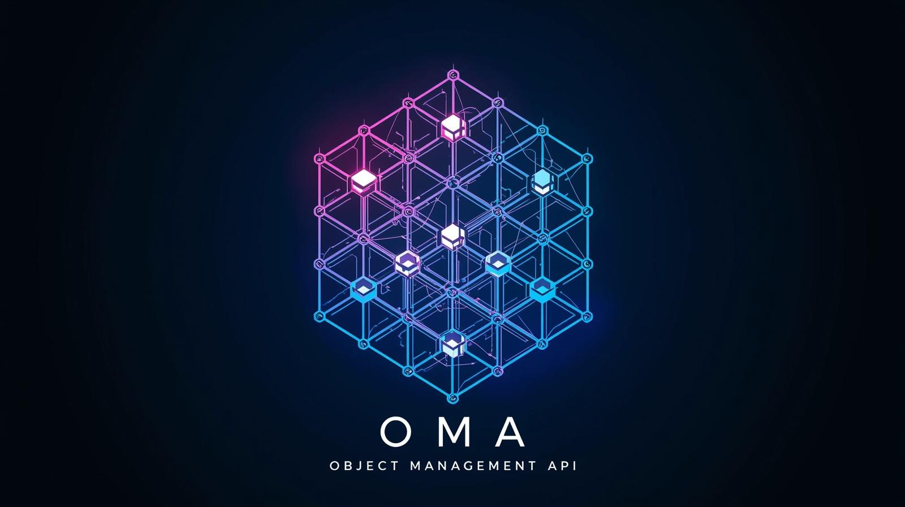

# OMA – Object Management API
**Version:** 1.0 (Early Development)  
**Owner:** The creator of this GitHub repository  
**License:** Proprietary – **Private Use Allowed**, Public/Commercial Use Requires Permission

---

## Overview
OMA (Object Management API) is a private Java-based framework designed for structured object management, grouped relationships, and secure value-handling systems.  
This project is currently in early development and **is not open-source**, but **private use is allowed**.

---

## Usage Terms

### ✅ You ARE allowed to:
- Download, view, and study the source code.
- Use OMA **privately on your own device**.
- Modify the code **privately** for learning, research, hobby, or educational experimentation.

### ❌ You are NOT allowed to:
- Use OMA in **public** projects (including GitHub, school submissions, or shared environments).
- Use OMA for **commercial** or **organizational** purposes.
- Distribute, fork, upload, or mirror this project.
- Rebrand, rename, or claim ownership of any part of the code.
- Sell or include the code in other software.

---

## Permission Requirement
If you want to use OMA in **any way that is not strictly private**, including:

- Public repositories
- Team or classroom projects
- Game or application integration
- Commercial or company internal use
- Server deployments or hosted environments

You **must first contact the repository owner and receive explicit written approval**.

---

## Liability Disclaimer
This software is provided **“as is”**, without any warranty of any kind, including but not limited to:

- Performance
- Reliability
- Fitness for any purpose
- Safety of data or systems

The owner is **not liable** for any damages or consequences resulting from use or misuse.  
Use at **your own risk**.

---

## Ownership & Licensing Rights
All source code, design logic, naming, and conceptual structures are the **intellectual property** of the repository owner.

The owner reserves the right to:
- Change or restrict access at any time
- Modify or extend licensing terms in the future
- Offer paid licenses, subscription usage, or enterprise agreements

No license rights are granted unless explicitly provided in writing.

---

## Contact
To request usage approval, licensing, or collaboration:
**Contact the repository owner directly through GitHub.**

---

**© 2025 The creator of this repository.  
Private use permitted. Public/commercial use prohibited without permission.**

   

